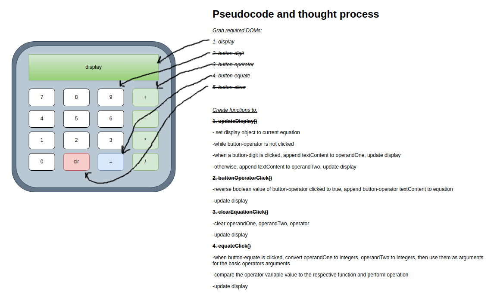

# Basic Online Calculator
This project is a simple web calculator that uses all of the skills and techniques learned from the TOP foundations course. Basic functionalities of a calculator will be implemented, along with a simple graphical user interface.

### Tasks
##### Functionality
- [x] Functions for basic math operators
  - [x] Add
  - [x] Subtract
  - [x] Multiply
  - [x] Divide
- [x] Perform Unit Test as functions are created
- [x] Track & Store operands for updating display
  
##### GUI
- [x] Buttons for digits and operators (0-9,+,-,*,/,=)
- [x] Button to clear numbers/operator (c)
- [x] Display for operands

The *node_modules* folder was not included to avoid slow commits. To run the operators unit test files, you must have the *node_modules* file which can be obtained by navigating to the root directory and entering the command ```mpm i --save-dev jest```

Once the *node_modules* folder is installed locally, enter the command ```npm test base_functions.test.js``` to run the unit test.

#### *Final notes*
The base functionalities for the calculator are implemented. For what it is meant to do (as a basic calculator), it works as intended. However, overall there are many improvements and bugs present when going beyond the scope of what the project asks for.

---
###### *Improvements and potential solutions*
**Improvement 1** - Digits overflowing the calculator display screen when there are too many to display.
**Possible solutions:**
- Add a limit to the operands buffer
- Shrink display text size as operand string count increases (*much more complex than above*)

**Improvement 2** - There is a limit of two operands and users cannot keep applying the same operation to the result once the equate button is clicked.
**Possible solutions:**
- Generate new operand variables to hold new values as the operator buttons are clicked.
  - This would mean a certain order must be applied to the equation (BEDMAS/PEMDAS)
  - Complex and will need refactoring
- Keep track of history as long as clr button is not clicked.
  - Maintain the same operator as the operation if multiple operands will be implemented

#### Appendix

